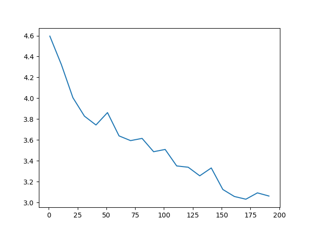
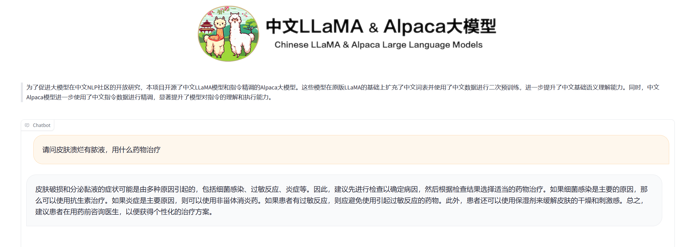

## 环境安装
--环境安装参考https://xtx0o8yn7x.feishu.cn/docx/ZdzYdNfHPoKkFMx5EBOcfjh0npb

1. 执行：git lfs install
    如果没有安装git-lfs，执行：

    ``curl -s https://packagecloud.io/install/repositories/github/git-lfs/script.deb.sh | sudo bash``

    ``sudo apt-get install git-lfs``

2. 克隆Llama2-chat-13B-Chinese-50W项目到本地
    如果hugging face不能连接，使用镜像网站。

    ``git clone https:///hf-mirror.com/RicardoLee/Llama2-chat-13B-Chinese-50W``

    权重文件过大可以手动下载

    ``wget https:///hf-mirror.com/RicardoLee/Llama2-chat-13B-Chinese-50W/resolve/main/pytorch_model-00001-of-00003.bin``

3. 环境安装

    3.1 先安装peft
    ```
    git clone https://github.com/huggingface/peft.git
    cd peft
    git checkout 13e53fc
    pip install .
    ```

    3.2 安装其他环境

    ``pip install -r requirements.txt``

4. 准备微调数据集

    使用了中文医疗对话数据集，来自https://github.com/Toyhom/Chinese-medical-dialogue-data

    该数据集包含总计 792099条数据：
    >**<Andriatria_男科>**  94596个问答对
    > **<IM_内科>**        220606个问答对
    **<OAGD_妇产科>**      183751个问答对
    **<Oncology_肿瘤科>**   75553个问答对
    **<Pediatric_儿科>**  101602个问答对
    **<Surgical_外科>**   115991个问答对
    
    最终微调数据集使用了22788条数据

## 代码使用

1. 运行微调代码,相关参数放在config.json里面

    ``python finetune.py``

    如果需要修改config.json路径,可以执行:

    ``python finetune.py`` --config_path [your config file path]

2. 合并模型,相关参数放在config.json里面

    ``python merge_model.py``

    如果需要修改config.json路径,可以执行:

    ``python merge_model.py`` --config_path [your config file path]

3. 运行推理文件,修改base_model路径为第二步生成的合并模型的路径

    ``sh infer.sh``

## 项目目录结构

```
.
├── config.json
├── data
│   └── Chinese-medical-dialogue-data
│       ├── data_processing.py
│       ├── merge_data.json
│       ├── 儿科5-14000.csv
│       ├── 内科5000-33000.csv
│       ├── 外科5-14000.csv
│       ├── 妇产科6-28000.csv
│       ├── 数据处理.py
│       ├── 男科5-13000.csv
│       └── 肿瘤科5-10000.csv
├── finetune.py
├── ft_results
│   └── 202403111710095664
│       ├── adapter_config.json
│       ├── adapter_model.safetensors
│       └── README.md
├── gradio_demo.py
├── infer.sh
├── list.txt
├── Llama2-chat-13B-Chinese-50W
│   ├── config.json
│   ├── generation_config.json
│   ├── LICENSE
│   ├── pytorch_model-00001-of-00003.bin
│   ├── pytorch_model-00002-of-00003.bin
│   ├── pytorch_model-00003-of-00003.bin
│   ├── pytorch_model.bin.index.json
│   ├── README.md
│   ├── sft_lora_model
│   │   ├── adapter_config.json
│   │   ├── adapter_model.bin
│   │   ├── special_tokens_map.json
│   │   ├── tokenizer_config.json
│   │   └── tokenizer.model
│   ├── special_tokens_map.json
│   ├── tokenizer_config.json
│   ├── tokenizer.model
├── merge_model
│   └── 202403111710096354
│       ├── config.json
│       ├── generation_config.json
│       ├── pytorch_model-00001-of-00003.bin
│       ├── pytorch_model-00002-of-00003.bin
│       ├── pytorch_model-00003-of-00003.bin
│       ├── pytorch_model.bin.index.json
│       ├── special_tokens_map.json
│       ├── tokenizer_config.json
│       └── tokenizer.model
├── merge_model.py
└── readme.md
    
```
## 微调结果
1. 运行200个step, loss图:


2. 项目结果:



